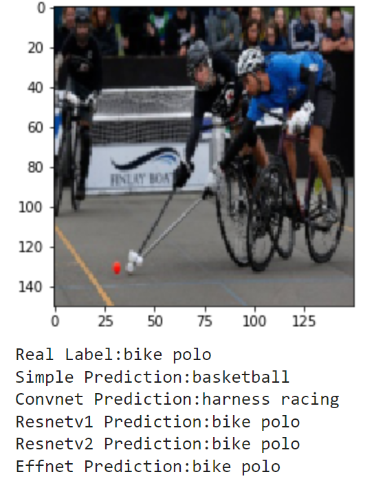

  
  
  
  

 

<h1 align="center"> Sports Images Classifier </h1>
<h3 align="center"> CSE 455 - Computer Vision </h3>
<h5 align="center"> Final Project - Garrett Devereux - <a href="https://courses.cs.washington.edu/courses/cse455/22sp/">University of Washington</a> (Spring 2022) </h5>

<h2>  Problem Description</h2>

Sports have always been an important part of my life, providing me with the motivation to constantly improve my skills and health, help build releationships and connections with others, and teach me lessons about teamwork and perserverance that carry over into my other pursuits. My project directly relates to this passion and aims to analyze a variety of images containing sports and classify them using neural networks and computer vision. My data set comes from this <a href="https://www.kaggle.com/datasets/gpiosenka/sports-classification?resource=download">Kaggle Competition</a> which contains over 14,000 images from 100 different sports. In my project, I explore a variety of different model architectures as well as different data processesing and training techniques such as data augmentation and transfer learning. I then compare and contrast each models performance and see how they do in the real world with pictures of myself playing sports throughout the years. 

<h2> Preexisting Work</h2>

All of the code in this repository is brand new for this project, using Professor Joseph Redmon's PyTorch tutorial as inspiration and utilizing the Kaggle Sports Images Dataset. All of the implementation resides in <a href="https://github.com/garrettdevereux/ComputerVisionFinal/blob/main/Final_Project.ipynb">Final_Project.ipynb</a> from a Colab project, and contains comprehensive documentation. The notebook provides a step-by-step walk though of the project as well as an analysis of the results. This site only synthesizes the information found from the notebook.  

<h2>  Project Files</h2>

All files from this project can be found in the <a href="https://github.com/garrettdevereux/ComputerVisionFinal">Repository</a>.

This Project includes a Colab project with all of the code, a dataset folder, and a results folder.

<h4>Code:</h4>
<ul>
  <li><b>Final_Project.ipynb</b> - Includes all of the implementation for the project included with a detailed walkthrough and analysis.</li>
</ul>

<h4>Dataset: in the <b>sportsImages/</b> folder</h4>
<ul>
  <li><b>sportsImages/models/</b> - Contains all of the trained models produced throughout the project, as well as .csv files showing each models prediction versus the actual label on the entire test set. *Note: the simple model was too large of a file to handle, so it is not included.</li>
  <li><b>sportsImages/realworld/</b> - Contains twenty different images of myself playing sports over the years. Used to check the models performance in the real world.</li>
  <li><b>sportsImages/test/</b> - Contains all 500 images of the test set. Inside /test/ are 100 folders labeled with the corresponding sport, and then inside each sport folder is five images.</li>
  <li><b>sportsImages/train/</b> - Contains all 13572 images of the training set. Inside /train/ are 100 folders labeled with the corresponding sport, and then inside each sport folder is on average 136 images.</li>
  <li><b>sportsImages/valid/</b> - Contains all 500 images of the validation set. Inside /valid/ are 100 folders labeled with the corresponding sport, and then inside each sport folder is five images.</li>
  <li><b>sportsImages/class_dict.csv</b> - A .csv file containing an entry for each sport in the form: index, sport name, height, width, scale. This allows us to take a prediction index and map it to a class name.</li>
</ul>

<h4><b>Results/</b>:</h4>
<ul>
  <li><b>Results/ComparisonResults/</b> - Includes 11 images for the validation comparison with each models prediction, and twenty images for the real world comparison with each of the five models predictions.</li>
  <li><b>Results/DatasetExampleImages/</b> - Includes two examples of a batch of 32 images from the training set with different augmentations applied.</li>
  <li><b>Results/TrainingResults/</b> Contains a graph of the training loss for each of the five models over 20 epochs, as well as a .txt file with the exact loss after every 10 batches during training. </li>
</ul>

<h4>Other:</h4>
<ul>
  <li><b>website/</b> - Includes all assets for the website.</li>
  <li><b>README.md</b> - This document. Includes the code for the website.</li>
  <li><b>_.config.yml</b> - Config file for the webpage.</li>
</ul>

<h2> Dataset and Preprocessing</h2>

The sportsImages dataset contains images from 100 different sports from air hockey to wingsuit flying. Reference the <a href="https://github.com/garrettdevereux/ComputerVisionFinal/blob/main/sportsImages/class_dict.csv">class_dict.csv</a> for all of the classes. There are 13572 images in the training set, and 500 in both the test and validation set. The images are 3x224x224 which I then size down to 3x150x150 to help reduce the dimensions and train faster. This greatly reduces the size of the simple model, which is still too big to store on github. On my first attempt of training the models, I performed a resize, random crop, random horizontal flip, random rotation, and then added gaussian noise to each image. 32 of these images looked like:

 
  

After training the models for the first time, I found the test accuracy was terrible, resulting in around 10% test accuracy for the simple model, 50% for the convolutional model, and 37% for the pretrained resnet18. It was clear that this augmentation was too different from the test set and was hurting the performance much more than it was helping. So, after experimenting with a variety of other augmentations, I finally found the right mix of Gaussian noise and rotation range to get the following: 

 
  

In order to load this dataset and perform the augmentations, view the sections 'Loading the Dataset', 'Data Augmentation', and 'Understanding the Dataset' in <a href="https://github.com/garrettdevereux/ComputerVisionFinal/blob/main/Final_Project.ipynb">Final_Project.ipynb</a>. These sections will also provide more in depth explanations of how to access and manipulate images, as well as how to print out batches like the two above.

<h2> Approach</h2>

<b> Building networks for classification </b>

<b> SimpleNet </b>

I first approached the problem by building a very simple model to get a baseline accuracy score and an idea of how comlplex the dataset is to learn. This simple model is called SimpleNet, and is a very vanilla Neural Network with a single hidden layer using leak relu activation. As the input images are augmented down to (3 x 150 x 150) the input size will be 67500. Additionally, since the model is making predictions for 100 classes, the final layer needs to be of size 100. With a hidden layer size of 512, there will be 34,611,200 (67500x512 + 512x100) different weights in the model. 

<b> Convnet </b>

As a better approach, I next worked to take advantage of the structure of images with convolutions, batch normalization, and pooling to greatly reduce the size of the network while increasing its power. Here I referenced Professor Redmon's demo lecture on Convolutional Neural Networks and chose to use the <a href="https://pjreddie.com/darknet/imagenet/#reference">Darknet Architecture</a>. As my images we much larger than the example (3x150x150 vs 3x64x64), I worked to tweak the strides of the different convolutions to produce a reasonably size result. This resulted in five convolutions taking the (3x150x150)->(16x50x50)->(32x25x25)->(64x13x13)->(128x7x7)->(256x4x4). Additionally, I changed the final output layer to size 100 to fits the number of classes in my dataset. 

<b> Resnetv1 </b>

 To continue to increase model performance, I then moved to using transfer learning on pretrained networks. As a first try of this, I again followed Redmon's demo and fit the pretrained resnet18 model to my own dataset. This required me to change the final fully connected layer to map to 100 classes rather than the over 20,000 categories of ImageNet.

<b> Resnetv2 and Effnet </b>

Finally, I wanted build a model better than all of the above by taking advantage of the techniques that worked and continuing to tweak the parameters and process. As transfer learning worked the best, I first worked to experiment with the data augmentation to see if I could find transformations that would produce better results. Using the exact same resnet18 architecture referenced above, I tried several different augmentations, adding more and less rotation and noise, removing the flipping and cropping of images, and in the end I found that keeping the horizontal image flips, removing the rotations and noise, and normalizing the image before putting it through the network worked the best. With this knowledge, I then again took advantage of transfer learning to bring in the Efficientnet_b0 with the new set of augmentations.

<b>Models Implemented:</b>

<ul>
	<li>SimpleNet</li>
	<ul>
		<li>1 Hidden Layer with Leaky Relu Activation</li>
		<li>Structure:</li>
		<ul>
			<li>Linear(67500, 512)</li>
			<li>Linear(512, 100)</li>
		</ul>
	</ul>
	<li>ConvNet</li>
	<ul>
		<li>DarkNet Architecture: 5 Convolutional Layers with batch normalization and a linear layer</li>
		<li>Structure:</li>
		<ul>
			<li>Conv2d(3, 16, 3, stride=3, padding=1)</li>
			<li>BatchNorm2d(16)</li>
		  <li>Conv2d(16, 32, 3, stride=2, padding=1)</li>
      <li>BatchNorm2d(32)</li>
			<li>Conv2d(32, 64, 3, stride=1, padding=1)</li>
			<li>BatchNorm2d(64)</li>
			<li>Conv2d(64, 128, 3, stride=2, padding=1)</li>
			<li>BatchNorm2d(128)</li>
			<li>Conv2d(128, 256, 3, stride=2, padding=1)</li>
			<li>BatchNorm2d(256)</li>
			<li>Linear(256, 100)</li>
		</ul>
	</ul>
	<li>Resnetv1 and Resnetv2</li>
	<ul>
    <li>Structure:</li>
		
		
	</ul>
  <li>Efficientnet_b0</li>
	<ul>
		<li>Structure:</li>
		
		
	</ul>
</ul>

 For futher reference, each of these models is implemented in <a href="https://github.com/garrettdevereux/ComputerVisionFinal/blob/main/Final_Project.ipynb">Final_Project.ipynb</a> with full explanation and results.

<h2>  Results</h2>

After training the models several times with different parameters, I ended with the following results: 

<b> SimpleNet: </b>

 20 Epochs, LR shedule: {0:0.01, 15: 0.001}, Batch Size: 128.

 

 Performance: <a href="https://github.com/garrettdevereux/ComputerVisionFinal/blob/main/Results/TrainingResults/simpleTraining.txt">Training Loss</a> ended at 3.4. <b>20.2% Testing Accuracy</b>. <a href="https://github.com/garrettdevereux/ComputerVisionFinal/blob/main/sportsImages/models/simple20Preds.csv"> Predictions versus Actual labels</a>.

<b> ConvNet: </b>

 20 Epochs, LR shedule: {0:0.1, 5:0.01, 15: 0.001}, Batch Size: 128.

 

 Performance: <a href="https://github.com/garrettdevereux/ComputerVisionFinal/blob/main/Results/TrainingResults/convnetTraining.txt">Training Loss</a> ended at 1.2. 66.4% Testing Accuracy after 20 epochs. <b>67.0% accuracy after 17 epochs</b>. <a href="https://github.com/garrettdevereux/ComputerVisionFinal/blob/main/sportsImages/models/convnet17Preds.csv"> Predictions versus Actual labels</a>.

<b> Resnetv1: </b>

 20 Epochs, LR shedule: {0:0.1, 5:0.01, 15: 0.001}, Batch Size: 128.

 

 Performance: <a href="https://github.com/garrettdevereux/ComputerVisionFinal/blob/main/Results/TrainingResults/resnetv1Training.txt">Training Loss</a> ended at 0.1. <b>92.2% Testing Accuracy after 20 epochs</b>. <a href="https://github.com/garrettdevereux/ComputerVisionFinal/blob/main/sportsImages/models/resnet20Preds.csv"> Predictions versus Actual labels</a>.

<b> Resnetv2: </b>

 20 Epochs, LR shedule: {0:0.1, 5:0.01, 15: 0.001}, Batch Size: 128.

 

 Performance: <a href="https://github.com/garrettdevereux/ComputerVisionFinal/blob/main/Results/TrainingResults/resnetv2Training.txt">Training Loss</a> ended at 0.015. <b>94.6% Testing Accuracy after 20 epochs</b>. <a href="https://github.com/garrettdevereux/ComputerVisionFinal/blob/main/sportsImages/models/resnetv20Preds.csv"> Predictions versus Actual labels</a>.

<b> EffNet: </b>

 20 Epochs, LR shedule: {0:0.1, 5:0.01, 15: 0.001}, Batch Size: 128.

 

 Performance: <a href="https://github.com/garrettdevereux/ComputerVisionFinal/blob/main/Results/TrainingResults/effnetTraining.txt">Training Loss</a> ended at 0.018. 95.6% Testing Accuracy after 20 epochs. <b>95.8% accuracy after 17 epochs</b>. <a href="https://github.com/garrettdevereux/ComputerVisionFinal/blob/main/sportsImages/models/effnet17Preds.csv"> Predictions versus Actual labels</a>.

<h2>  Comparison</h2>

<b> Validation Comparison </b>

First, I wanted to compare and contrast how each model interpreted different images. I wanted to see if the models generally agreed, or if they failed how similar their incorrect prediction was to the correct one. I also thought it would be interesting to see if the pretrained models would disagree. Here are the results I found when running each model on a random batch of validation photos: 

 

 Overall, these results were very consistent with the testing accuracy... Simple way off, also close with background colors. Differences in pre trained models.  

<b> Real World Comparison </b>

Finally, I wanted to see how the models could do off in the real world. I compiled the set of images 'real_world' which contains 20 images of me doing a bunch of different activites. These include photos of me playing football and baseball in high school (and even T-ball), kayaking, paddle boarding and surfing, and other photos of me and my friends posing for a photo on a basketball court, football field, or golf course. These photos have no labels, and some don't even match a sport but we can still examine how the models make their predictions. Here are the models predicting the classes for these photos: 

 

As these are much different from the testing set, it makes sense that the models don't do great. It seems that the action shots for football and baseball are classified pretty well by all of the models. However, there is a lot of confusion for the photos where I am just standing and posing. (More analysis.)

Overall, it is really cool to see how each model's learning transfers to a different set in the real world.

Note: See the 'Comparison of the Models', 'Comparison Function', 'Compare on Validation', and 'Real World Application' in <a href="https://github.com/garrettdevereux/ComputerVisionFinal/blob/main/Final_Project.ipynb">Final_Project.ipynb</a> to see a full explanation as well as how the code was implemented to aquire these results.

<h2>   References</h2>
<ul>
  <li>
Joseph Redmon, 'iPynb Tutorial Series'. [Online].

      
Available: <a href = "https://courses.cs.washington.edu/courses/cse455/22sp/">https://courses.cs.washington.edu/courses/cse455/22sp/</a>

  </li>
  <li>
Gerry's Kaggle Dataset, '100 Sports Image Classification'. [Online].

      
Available: <a href = "https://www.kaggle.com/datasets/gpiosenka/sports-classification?resource=download">https://www.kaggle.com/datasets/gpiosenka/sports-classification?resource=download</a>

  </li>
</ul>

<!-- CREDITS -->
<h2 id="credits"> Credits</h2>

Garrett Devereux

