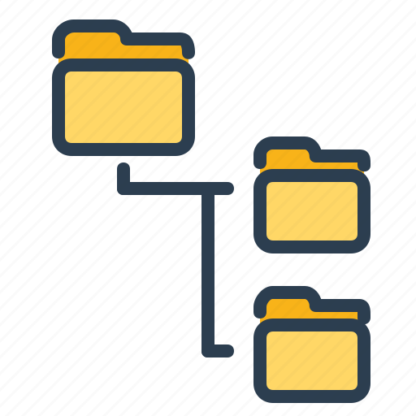

 
  

<h1 align="center"> Sports Images Classifier </h1>
<h3 align="center"> CSE 455 - Computer Vision </h3>
<h5 align="center"> Final Project - <a href="https://courses.cs.washington.edu/courses/cse455/22sp/">University of Washington</a> (Spring 2022) </h5>

<h2>  Problem Description</h2>

Sports have always been an important part of my life, providing me with the motivation to constantly improve my skills and health, help build releationships and connections with others, and teach me lessons about teamwork and perserverance that carry over into my other pursuits. My project directly relates to this passion and aims to analyze a variety of images containing sports and classify them using neural networks and computer vision. My data comes from this <a href="https://www.kaggle.com/datasets/gpiosenka/sports-classification?resource=download">Kaggle Competition</a>

<h2> Preexisting Work</h2>

Sports have always been an important part of my life, 

<h2>  Project Files</h2>

All files can be found repo.

This Project includes 3 executable files, 3 text files as well as 2 directories as follows:

<h4>Executable Files:</h4>
<ul>
  <li><b>spam_detector.py</b> - Includes all functions required for classification operations.</li>
  <li><b>train.py</b> - Uses the functions defined in the spam_detector.py file and generates the model.txt file after execution.</li>
  <li><b>test.py</b> - Uses the functions defined in the spam_detector.py file and, after execution, generates the result.txt as well as evaluation.txt files.</li>
</ul>

<h4>Output Files:</h4>
<ul>
  <li><b>model.txt</b> - Contains information about the vocabularies of the train set, such as the frequency and conditional probability of each word in Spam and Ham classes.</li>
  <li><b>result.txt</b> - Contains information about the classified emails of the test set.</li>
  <li><b>evaluation.txt</b> - Contains evaluation results table as well as Confusion Matrix of Spam and Ham classes.</li>
</ul>

<h4>Source Directories:</h4>
<ul>
  <li><b>train directory</b> - Includes all emails for the training phase of the program.</li>
  <li><b>test directory</b> - Includes all emails for the testing phase of the program.</li>
</ul>

<h2> :book: Dataset and Preprocessing</h2>

In machine learning, naive Bayes classifiers are a family of simple "probabilistic classifiers" based on applying Bayes' theorem with strong (naive) independence assumptions between the features.
Abstractly, naive Bayes is a conditional probability model: given a problem instance to be classified, represented by a vector

representing some n features (independent variables), it assigns to this instance probabilities

The problem with the above formulation is that if the number of features n is large or if a feature can take on a large number of values, then basing such a model on probability tables is infeasible. We therefore reformulate the model to make it more tractable. Using Bayes' theorem, the conditional probability can be decomposed as

<h2> :clipboard: Approach</h2>

The order of execution of the program files is as follows:

<b>1) spam_detector.py</b>

First, the spam_detector.py file must be executed to define all the functions and variables required for classification operations.

<b>2) train.py</b>

Then, the train.py file must be executed, which leads to the production of the model.txt file. 
At the beginning of this file, the spam_detector has been imported so that the functions defined in it can be used.

<b>3) test.py</b>

Finally, the test.py file must be executed to create the result.txt and evaluation.txt files.
Just like the train.py file, at the beginning of this file, the spam_detector has been imported so that the functions defined in it can be used.

<h2> :clipboard: Results</h2>

<h2> :clipboard: Comparison</h2>

<h2> :clipboard: Discussion</h2>

<h2>   Refrences</h2>
<ul>
  <li>
Joseph Redmon, 'iPynb Tutorial Series'. [Online].

      
Available: https://courses.cs.washington.edu/courses/cse455/22sp/

  </li>
  <li>
Mohammad Amin Shamshiri, 'READMD.md template'. [Online].

      
Available: https://github.com/ma-shamshiri/Spam-Detector/blob/master/README.md

  </li>
</ul>

<!-- CREDITS -->
<h2 id="credits"> :scroll: Credits</h2>

Garrett Devereux

